演示项目地址 [react-router-dynamic-import](https://github.com/ThreeGuns/react-router-dynamic-import)

`技术栈：webpack v4、react、react-router`

webpack将react项目打包，根据入口文件，生成输出打包文件。通过`html-webpack-plugin`插件就可以将生成的打包文件配置到模板文件。

一个简单的配置文件

```
const path = require('path');
const webpack = require('webpack');

const HtmlWebpackPlugin = require('html-webpack-plugin');

module.exports = {
    devtool: 'source-map',
    entry: {
        'main.bundle': './src/index.js',
        'module1.bundle': './src/module1/index.js',
    },
    output: {
        path: path.resolve(__dirname, 'dist'),
        filename: 'bundle.js'
    },
    module: {
        rules: [
            {
                test: /\.js|\.jsx$/,
                use: [{loader: 'babel-loader'}],
                include: /src/,
                exclude: /node_modules/,
            },
        ]
    },
    plugins: [
        new HtmlWebpackPlugin({
            chunks: ['main.bundle'],
            filename: 'index.html',
            template: path.resolve(__dirname, './src/index.html')
        }),
    ]
};
```

如果项目比较大，最后生成的打包文件会比较大，可能会有数兆。网络情况不好时，对用户体验不友好，严重情况下甚至会出现页面无法加载的情况。

这个时候需要将打包文件拆分，在`entry`处设置多`chunk`，如下

```
//chunk 表示打包的代码块，filePath是打包这个代码块时的入口文件
{
	entry: {
		chunkName1: 'module1FilePath',
		chunkName2: 'module2FilePath',
		...
	}
	output: {
		path: path.resolve(__dirname, './dist'),
        filename: '[name].[hash:8].js',
	}
}
```

生成的html模板里面就会有两个入口

```
<script type="text/javascript" src="chunkName1.295a5653.js"></script>
<script type="text/javascript" src="chunkName2.295a5653.js"></script>
```

虽然包时分开了，但是还是同步加载，并没有解决实际问题。

同类问题参见 [前端模块加载](http://123.57.244.51/article/84392db0-b472-11e6-bfa7-093d5b136c02) [backbone+requirejs 两级加载模块](http://123.57.244.51/article/ca907c60-4471-11e8-9ebb-9fb9b4dcf0f0)

这里需要拆分模块的同时，异步加载模块。

参照上面两篇笔记，还是需要以router为入口

[react-router github](https://github.com/ReactTraining/react-router) 

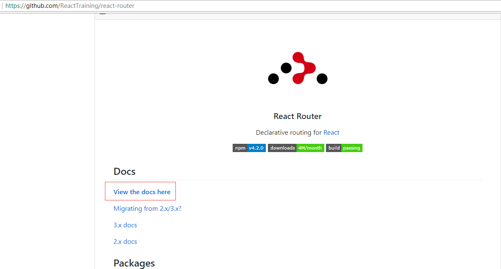

[reacttraining react-router 文档](https://reacttraining.com/react-router/) 

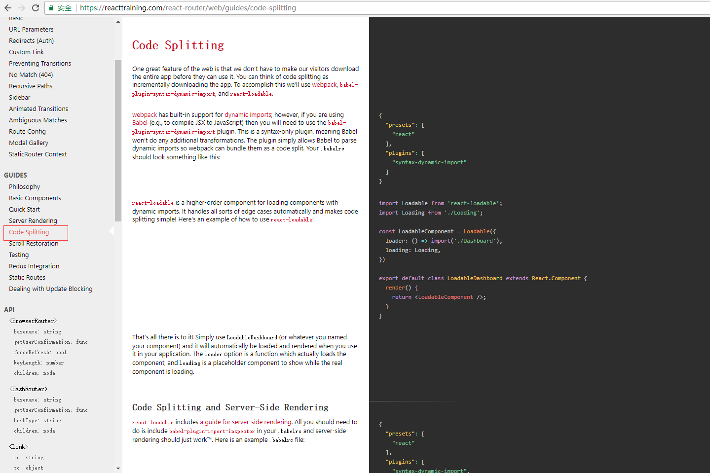

对于异步加载，文档里面给出的解决方案叫`Code Splitting`

下面是此方案的翻译，以及详细解释。


One great feature of the web is that we don’t have to make our visitors download the entire app before they can use it. You can think of code splitting as incrementally downloading the app. To accomplish this we’ll use webpack, babel-plugin-syntax-dynamic-import, and react-loadable.

用户在使用web的时候，不要让用户下载整个app。开发者应该按照模块开发功能，并让用户按需加载。为此，需要用到`webpack`、`babel-plugin-syntax-dynamic-import`、 `react-loadable` 去实现这个目标。


####dynamic import
首先了解 dynamic import [proposal-dynamic-import](https://github.com/tc39/proposal-dynamic-import)


This repository contains a proposal for adding a "function-like" import() module loading syntactic form to JavaScript.

这个JavaScript建议提供了一个类似于方法的模块，它的语法是`import()`


Motivation and use cases

动机以及如何使用

The existing syntactic forms for importing modules are static declarations. They accept a string literal as the module specifier, and introduce bindings into the local scope via a pre-runtime "linking" process. This is a great design for the 90% case, and supports important use cases such as static analysis, bundling tools, and tree shaking.

现有的模块加载方式是静态声明，它接受模块的字符串名称，通过预运行时中的liking进程绑定模块，在90%的情况下，这是一个非常好的设计，它支持比如静态统计、绑定工具、剔除无用代码等重要场景。

However, it's also desirable to be able to dynamically load parts of a JavaScript application at runtime. This could be because of factors only known at runtime (such as the user's language), for performance reasons (not loading code until it is likely to be used), or for robustness reasons (surviving failure to load a non-critical module). Such dynamic code-loading has a long history, especially on the web, but also in Node.js (to delay startup costs). The existing import syntax does not support such use cases.

但是，因为一些运行时的因素、性能方面的因素(直到用户用到才加载)、健壮性因素(启动时一些非必要模块加载失败导致项目启动失败)，我们还希望能够动态的加载javascript应用的模块。这类模块的动态加载已经有很长的历史了，特别在时web领域、nodejs(延时加载)。但是现有的import语法不支持这些应用场景。

Truly dynamic code loading also enables advanced scenarios, such as racing multiple modules against each other and choosing the first to successfully load.

当然了动态模块加载也会触发其他一些问题，比如复杂模块在异步加载时，如何保证其依赖的模块能够在它加载之前先加载（因为模块已经定义为时异步加载了，你要额外的去定义异步加载时候的一些依赖关系以及他们的加载顺序）。

Proposed solution

建议解决方案

This proposal adds an import(specifier) syntactic form, which acts in many ways like a function (but see below). It returns a promise for the module namespace object of the requested module, which is created after fetching, instantiating, and evaluating all of the module's dependencies, as well as the module itself.

添加一个特殊的import语法形式，它能够以以函数的形式执行，当与当前模块关联的代码执行的时候，就返回一个与请求加载模块对应的模块命名的promise对象，使用这个promise对象的时候就像使用模块本身一样。

Here specifier will be interpreted the same way as in an import declaration (i.e., the same strings will work in both places). However, while specifier is a string it is not necessarily a string literal; thus code like import(`./language-packs/${navigator.language}.js`) will work—something impossible to accomplish with the usual import declarations.

现有的import语句不能支持非字符串之外的模块解析，比如import(`./language-packs/${navigator.language}.js`)

import() is proposed to work in both scripts and modules. This gives script code an easy asynchronous entry point into the module world, allowing it to start running module code.

import() 建议既能用在模块引用，也能用在代码块中。这样就能方便的代码运行过程中，甚至是使用过程中，提供一些简单的模块异步加载入口。

Like the existing JavaScript module specification, the exact mechanism for retrieving the module is left up to the host environment (e.g., web browsers or Node.js). This is done by introducing a new host-environment-implemented abstract operation, HostPrepareImportedModule, in addition to reusing and slightly tweaking the existing HostResolveImportedModule.

如同现有的模块规范，实际的机制是由用户环境控制的（比如浏览器环境或者nodejs环境）。对于现存的`加载处理模块`，补充以`预加载处理模块`。

(This two-tier structure of host operations is in place to preserve the semantics where HostResolveImportedModule always returns synchronously, using its argument's [[RequestedModules]] field. In this way, HostPrepareImportedModule can be seen as a mechanism for dynamically populating the [[RequestedModules]] field. This is similar to how some host environments already fetch and evaluate the module tree in ahead of time, to ensure all HostResolveImportedModule calls during module evaluation are able to find the requested module.)

`加载处理模块`只能同步返回模块，`预加载处理模块`则动态的添加到一个模块树中，以保证其依赖的模块已经全部加载完毕。

------------------------------------------------

下面是一个动态import的实例，实现了点击按钮的时候才加载指定的模块

```
<a id="link" href="books.html" data-entry-module="books">Books</a>
<script>
	cosnt link = document.querySelector("#link");
	link.addEventListener("click", e => {
	  e.preventDefault();

	  import(`./section-modules/${link.dataset.entryModule}.js`)
		.then(module => {
		  module.loadPageInto(main);
		})
		.catch(err => {
		  main.textContent = err.message;
		});
	});
</script>
```

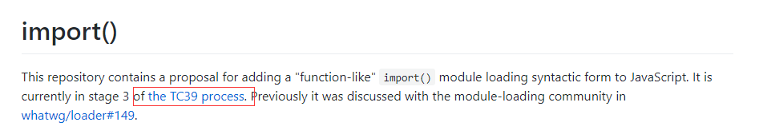

详见[The TC39 Process](https://tc39.github.io/process-document/)


####babel-plugin-syntax-dynamic-import
[babel-plugin-syntax-dynamic-import](https://babeljs.io/docs/plugins/syntax-dynamic-import/) 它只是一个语法插件，告诉babel不要对dynamic import部分的内容做任何的语法转换，只是告诉webpack将dynamic import的代码按照 code split 打包。

引用模块
```
npm install --save-dev babel-plugin-syntax-dynamic-import
```

在.babelrc中添加如下配置即可
```
{
  "plugins": ["syntax-dynamic-import"]
}

```
或者在package.json中配置

```
{
"babel": {
    "plugins": [
      "syntax-dynamic-import"
    ]
  }
}
```

####react-loadable
[react-loadable](https://github.com/jamiebuilds/react-loadable)， is a higher-order component for loading components with dynamic imports. It handles all sorts of edge cases automatically and makes code splitting simple! 

引用模块

```
yarn add react-loadable
```

loadable的具体应用在后续的实例中展示

实际上react-loadable是借助于webpack v4的新特性--> [Optimization SplitChunksPlugin](https://webpack.js.org/plugins/split-chunks-plugin/) 来实现异步模块的code split的，

####webpack Optimization SplitChunksPlugin
[SplitChunksPlugin](https://webpack.js.org/plugins/split-chunks-plugin/)

其默认配置如下

```
splitChunks: {
    chunks: "async",
    minSize: 30000,
    minChunks: 1,
    maxAsyncRequests: 5,
    maxInitialRequests: 3,
    automaticNameDelimiter: '~',
    name: true,
    cacheGroups: {
        vendors: {
            test: /[\\/]node_modules[\\/]/,
            priority: -10
        },
    default: {
            minChunks: 2,
            priority: -20,
            reuseExistingChunk: true
        }
    }
}
```

是对异步模块单独打包的。

所以在默认情况下：仅使用react-loadable，就能实现异步模块单独打包，以及异步加载。

--------------------------

####实际项目中的应用
1. 新建一个react项目[react-router-dynamic-import](https://github.com/ThreeGuns/react-router-dynamic-import)
	
	```
	midrk react-router-dynamic-import
	cd react-router-dynamic-import
	npm init
	```

2. 引入dependencies
	- `react`, `react-dom`, `react-router`, `react-router-dom`
	- `react-loadable`
	
	```
	yarn add react react-dom react-router react-router-dom react-loadable
	```
	
3. 引入devDependencies
	- `babel-core`, `babel-loader`, `babel-preset-env`, `babel-preset-react`, `babel-plugin-syntax-dynamic-import`
	- `webpack`
	- `webpack-cli`
	- `webpack-dev-server`

	```
	yarn add babel-core babel-loader babel-preset-env babel-preset-react babel-plugin-syntax-dynamic-import webpack webpack-cli webpack-dev-server html-webpack-plugin -D
	```
	
4. 配置 babel preset 以及 `syntax-dynamic-import`，在package.json中添加配置
	
	```
	"babel": {
		"presets": [
		  "react",
		  "env"
		],
		"plugins": [
		  "syntax-dynamic-import"
		]
	  },
	```

5. 设置项目录如下，入口文件为`src/index.js`
	
	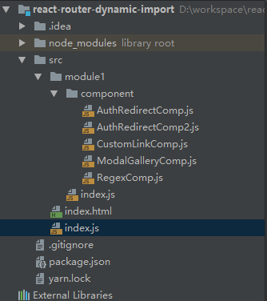
	
6. 	配置webpack (根目录下webpack.config.js)
	
	```
	const path = require('path');
	const webpack = require('webpack');

	const HtmlWebpackPlugin = require('html-webpack-plugin');

	module.exports = {
		mode: 'development',
		devtool: 'source-map',
		entry: {
			'main.bundle': './src/index.js',
		},
		output: {
			path: path.resolve(__dirname, 'dist'),
			// filename: 'bundle.js'
			filename: '[name].js',
			chunkFilename: '[name].[id].js',
		},
		module: {
			rules: [
				{
					test: /\.js$/,
					use: [{loader: 'babel-loader'}],
					include: /src/,
					exclude: /node_modules/,
				},
			]
		},
		plugins: [
			new HtmlWebpackPlugin({
				chunks: ['main.bundle'],
				filename: 'index.html',
				template: path.resolve(__dirname, './src/index.html')
			}),
		]
	};
	```

7. 添加npm scripts (package.json中添加配置)
	
	```
	"scripts": {
		"dev": "webpack-dev-server --inline --content-base .",
		"start": "rimraf dist && webpack"
	  },
	```
	
8. 启动dev

	```
	npm run dev
	```
	
9. 	访问。显示一个正常的react-router控制app

	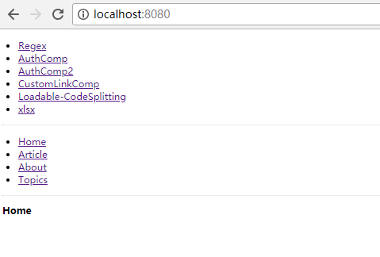
	
10. 添加一个dynamic import module --> module2

	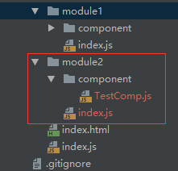
	
	`index.js`
	```
	import React from 'react';
	import Loadable from 'react-loadable';

	const Loading = () => <div>loading ...</div>;

	const LoadableComp = Loadable({
		loader: () => import('./component/TestComp'),
		loading: Loading
	});

	export default LoadableComp;
	```
	
	`TestComp.js`
	```
	import React from 'react';

	class TestComp extends React.Component{
		render(){
			return <div>test component ...</div>;
		}
	}

	export default TestComp;
	```
	
11. 在`module1/index.js`中引用module2，同时添加一个链接，在点击的时候加载module2组件

	```
	import CodeSplitting from '../module2';
	...
	
	<li><Link to={`/Loadable`}>Loadable-CodeSplitting</Link></li>
	...
	
	 <Route path={`/Loadable`} component={CodeSplitting}/>
	```	
	
12. 再查看页面	
	
	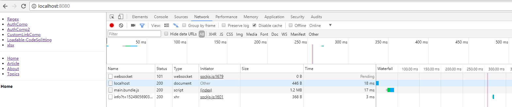
	
13. 点击 `Loadable-CodeSplitting` 链接

	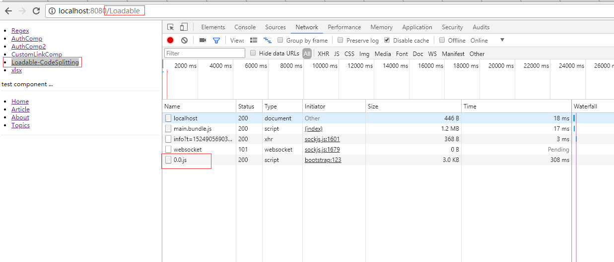
	
	可以看到其在点击之后，才加载 `0.0.js`
	
	至此，项目异步打包和加载已经实现了。然后再使用webpack打包，看下实际打包的结果。
	
14. 执行

	```
	npm start
	```
	
	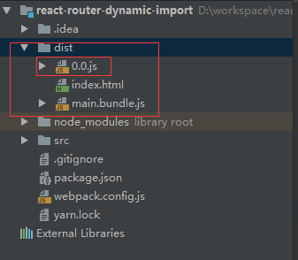
	
	可以看到实际打包的结果，确实如此
	
15. 然后就能以模块的形式去开发前端代码了。比如再添加一个`xlsx`模块

	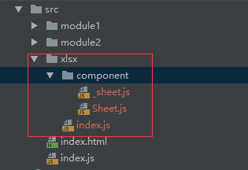
	
	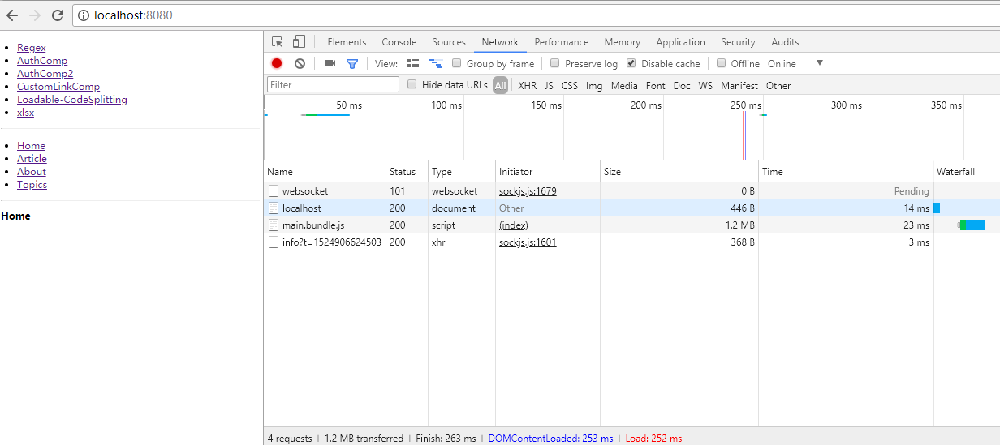
	
	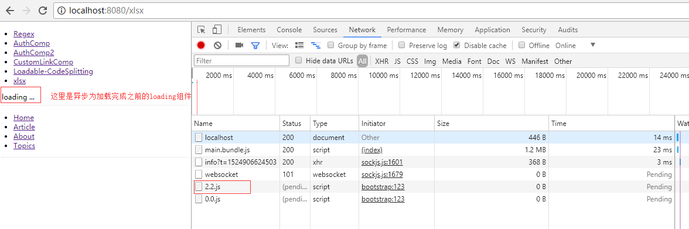
	
	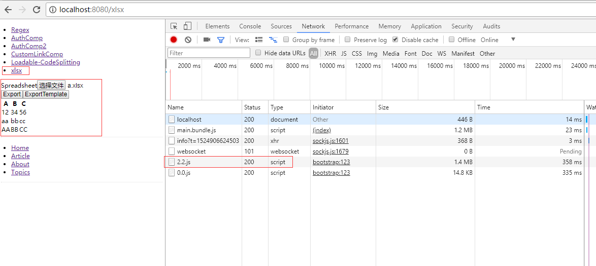
	
--------------------------

名词解释
- tree shaking
	简单说就是剔除无用代码，用在前端项目打包、生产环境部署等场景

	[如何评价 Webpack 2 新引入的 Tree-shaking 代码优化技术？](https://www.zhihu.com/question/41922432)
	
	[tree shaking简单分析](https://segmentfault.com/a/1190000010123067)
